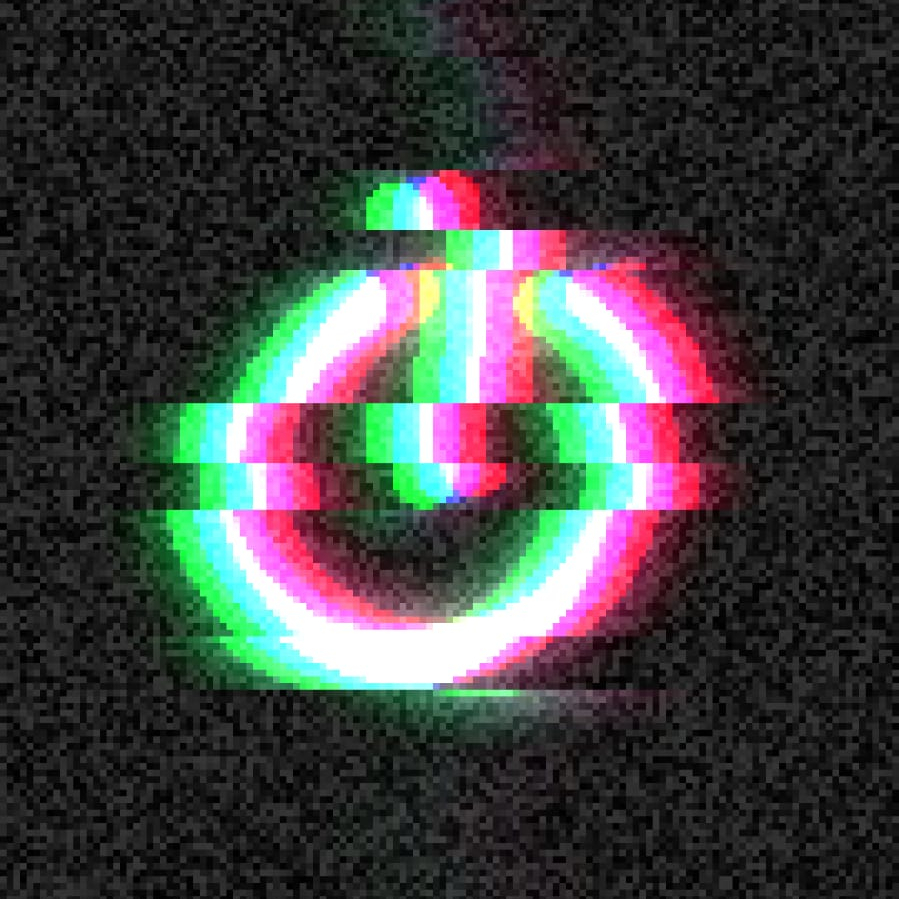

# ShaderEditor Examples
A collection of over 50 fragment shaders I've created using [ShaderEditor](https://github.com/markusfisch/ShaderEditor).

Note that some shaders contain unpolished or unoptimized code. I tediously wrote all of them on my smartphone as a pastime and to prototype ideas on the fly. I hope they'll inspire you anyway.

## Screenshots
     

## How to display them
There are two options:
1. Download [Shader Editor](https://play.google.com/store/apps/details?id=de.markusfisch.android.shadereditor&hl=en) and place the .glsl files in Download/ShaderEditor. In the app, navigate to Settings, scroll all the way down and choose "Import shaders".
2. Be a shader wizard, copy the shader into an environment of your choice and supply similar uniform values to the shader.

Be aware that some shaders require specific input [textures](Textures). Simply download them to your mobile device and import them into Shader Editor.

## License
This project is licensed under the MIT License - see the [LICENSE](LICENSE) file for details.

